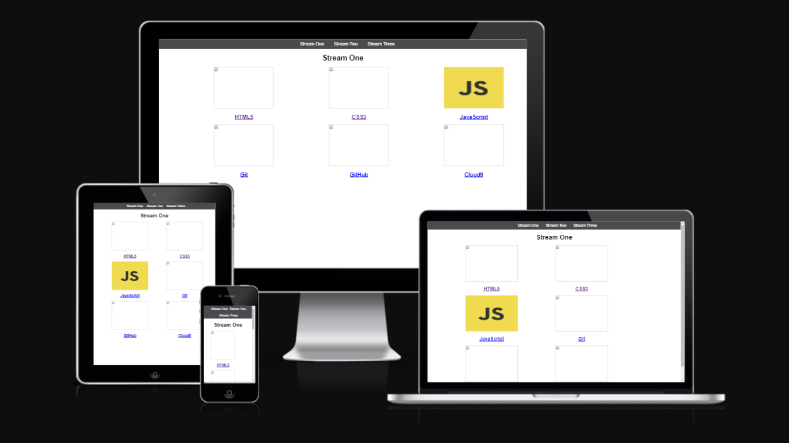

# My first website

## Introduction

As a part of the self-learning part of the Full-stack diploma program at Code institute, the website has been developed. 

## Purpose

This has let us to get familiar with three of the main areas,

1. Command-line interface: text-based interface to work with files & folders and run programs. 

2. GIT: the CLI terminal for version control, collaboration & examination.
3.	GitHub: a program to store different versions of our work 

## Content

The website pages show key tools (software) that we mainly used in Full-stack development. For you to enlighten your ambition of being a Full-stack developer it is required to get familiar with them, utilize them optimally, and showcase your talent with a great GitHub repository.

## Technology Used

We have used, 
1. HTML5
2. CSS3 and 
3. JavaScript, along with Cloud9 technology to develop the website.

## Unfixed Bugs

There are several bugs on the site. We will debug them as we move along the course.  

## Contributors
Credit shall go to the tutor team members of Code Institute for their support.

## References

We have referred to the below content apart from the learning content provided by Code Institute.  

1. [Markdown Cheatsheet](https://github.com/adam-p/markdown-here/wiki/Markdown-Cheatsheet#tables)
2. [Am I Responsive?](https://ui.dev/amiresponsive?url=https://pjdevex.github.io/push2ghII/index.html)
